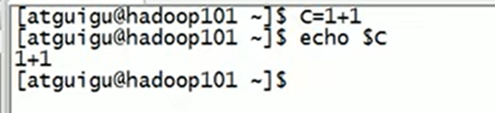
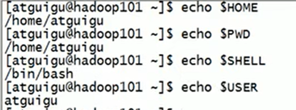
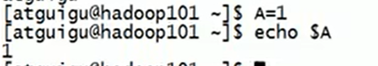
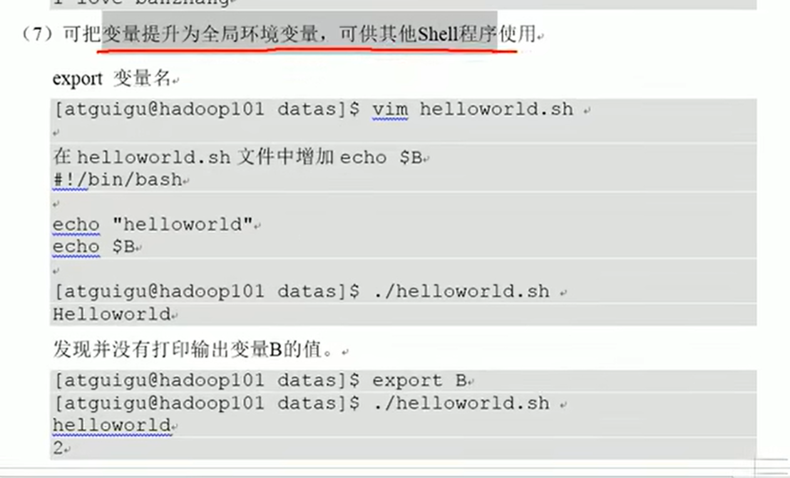
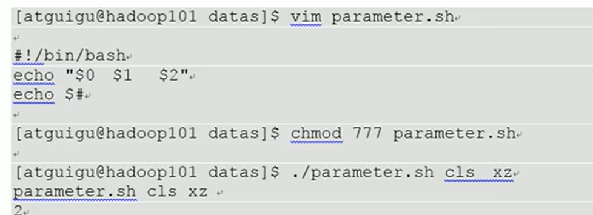

# lecture 2 variable

## -4 the variable in shell

default the variable will be string, cant be used to calculate as a number



#### -4.1 the system variable

1.most used

$HOME,$PWD,$SHELL,$USER..

2.examples

(1) look the value of system variable

```
$ echo $HOME
/home/bala
```



(2)look the variables in the current shell

```
$ set
BASH=/bin/bash
BASH_ALIASES =()
BASH_ARGC =()
BASH_ARGV =()
```

#### 4.2 set own variables

##### (1) set

```
A=1
echo $A
1
```



**(be careful there should not have blank around the "="!)**

##### (2)unset

```
unset A //unset the variable A
```

##### (3)static variable

```
$readonly B=3
$echo $B
3
```

note that static variable cannot be uset



#### 4.3 special variables $n

1. basic

$n(n is number,$0 - Check current script name, $1-$9 argument 1 to 9. ${10} argument 10 ...)

2. example

```
touch parameter.sh
vim parameter.sh
```

```sh
#!/bin/bash
echo "$0 $1 $2"
```

```sh
bash parameter.sh hello i
parameter.sh hello i
```


#### 4.4 special variables $#

1. basic

   $#(get all the number of input parameter, usually used in loop)

   2. example

      (1) 


#### 4.5 special variables $*,$@

$*(all the parameter in command,as full)

$@(all the parameter in command, as seperate)


to p9


